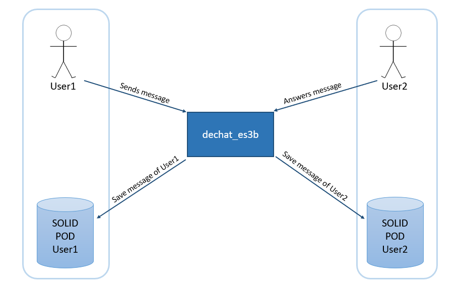
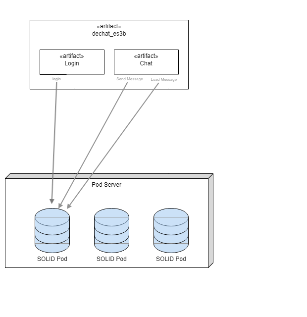

[[section-system-scope-and-context]]
== System Scope and Context

****
Our application consists of a decentralized chat in which a user can have conversations with other users. Based on this information we can differentiate two different contexts of our system:
****

=== Business Context

****
The following diagram shows how all parts of the system communicate when chatting, that is, when one user sends a message to another:

As you can see in the diagram, each user has his own SOLID Pod, where all the messages he sends will be stored. However, sent messages will not be stored in the receiver's Pod, keeping the SOLID philosophy in which each user has full control over their data. 
This way to see the message history of the conversation both users will have to allow the other one 
the visualization of your sent messages.

.Summary of actions carried out in communication
[cols="1,2" options="header"]
|=======================
|Involved part         |Action
|User1                 |Sends a message to User2
|User1 Pod             |Store the sent message
|User2                 |Receives the message from User1 and answers it
|User2 Pod             |Store the response message
|=======================

****

=== Technical Context

****
For now the technical context of our application shows in a very general way the technologies to use, as the application is implemented will be added to the project new technologies and updating this section.

The application consists of a device responsible for logging in or out and another that will handle the char itself, ie sending and receiving messages. The whole application itself will use a Pod server that will identify the user and save the messages sent by him.

****
