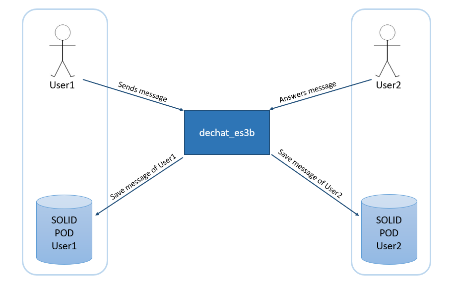
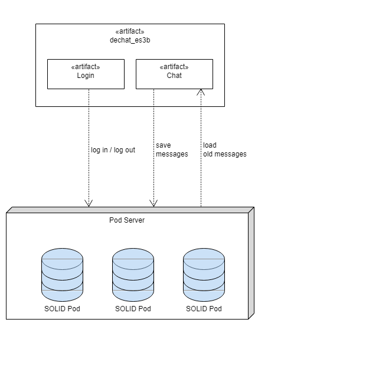

[[section-system-scope-and-context]]
== System Scope and Context

[role="arc42help"]
****
Our application consists of a decentralized chat in which a user can have conversations with other users. Based on this information we can differentiate two different contexts of our system:
****

=== Business Context

[role="arc42help"]
****
The following diagram shows how all parts of the system communicate when chatting, that is, when one user sends a message to another:

As you can see in the diagram, each user has his own SOLID Pod, where all the messages he sends will be stored. However, sent messages will not be stored in the receiver's Pod, keeping the SOLID philosophy in which each user has full control over their data. 
This way to see the message history of the conversation both users will have to allow the other one 
the visualization of your sent messages.

.Summary of actions carried out in communication
[cols="1,2" options="header"]
|=======================
|Involved part         |Action
|User1                 |Sends a message to User2
|User1 Pod             |Store the sent message
|User2                 |Receives the message from User1 and answers it
|User2 Pod             |Store the response message
|=======================

****

=== Technical Context

[role="arc42help"]
****
For now the technical context of our application shows in a very general way the technologies to use, as the application is implemented will be added to the project new technologies and updating this section.

The application consists of a device responsible for logging in or out and another that will handle the char itself, ie sending and receiving messages. The whole application itself will use a Pod server that will identify the user and save the messages sent by him.

****

[[section-system-scope-and-context]]
== Alcance y Contexto del Sistema

[role="arc42help"]
****
Nuestra aplicación consiste en un chat descentralizado en el que un usuario puede mantener conversaciones con otros usuarios. Con esta información como base podemos diferenciar dos contextos diferentes de nuestro sistema:
****

=== Contexto de Negocio

[role="arc42help"]
****
El siguiente diagrama muestra como se comunican todas las partes del sistema al chatear, es decir, cuando un usuario envía un mensaje a otro:

Tal como se observa en el diagrama cada usuario tiene un Pod en SOLID propio, en él se almacenarán todos los
mensajes que envíe. Sin embargo, los mensajes enviados no se almacenarán en el Pod del receptor manteniendo así
la filosofía de SOLID en el que cada usuario tiene el control total sobre sus datos.
De esta manera para ver el historial de mensajes de la conversación ambos usuarios tendrán que permitir al otro
la visualización de sus mensajes enviados.

.Resumen de acciones llevadas a cabo en la comunicación

[cols="1,2" options="header"]
|=======================
|Parte involucrada        |Acción
|Usuario1                 |Envía un mensaje a Usuario2
|Pod Usuario1             |Guarda el mensaje enviado
|Usuario2                 |Recibe el mensaje de Usuario1 y le contesta
|Pod Usuario2             |Guarda el mensaje con el que ha contestado Usuario2
|=======================
****

=== Contexto Técnico

[role="arc42help"]
****
Por ahora el contexto técnico de nuestra aplicación muestra de una manera muy general las tecnologías a usar, según se vaya implementando la aplicación se irán agregando al proyecto nuevas tecnologías y actualizando este apartado.

La aplicación consta de un artefacto encargado de iniciar o cerrar sesión y otro que manejará el char en sí, es decir, el envío y recibo de mensajes. Toda la aplicación en sí utilizará un servidor de Pods con el que se identificará al usuario y se guardarán los mensajes enviados por el mismo.

****
