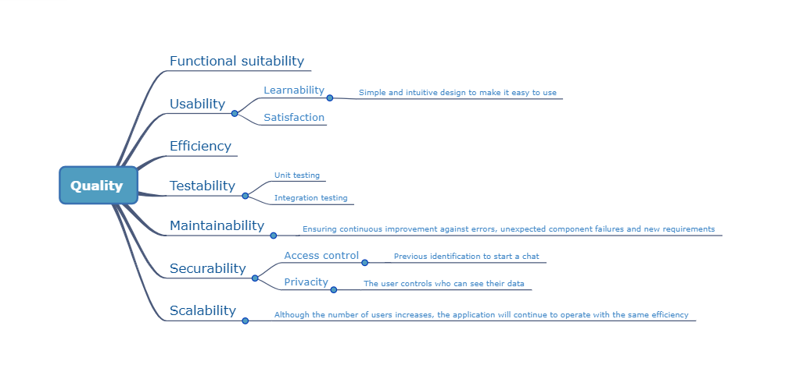

[[section-quality-scenarios]]
== Quality Requirements

[role="arc42help"]
****
This section deals with the quality requirements of the application using the quality tree and quality scenarios. 
The quality goals are further explained in section 1.2.
****

=== Quality Tree

[role="arc42help"]
****

****

=== Quality Scenarios

[role="arc42help"]
****
[options="header",cols="1,2,3"]
|===
| *AQ* | *Scenario* | *Priority*
| Functional suitability | The application must correctly meet the minimum requirements for a conversation to take place between two users| High, high
| Usability | The application must be easy to understand and use to satisfy the user| High, medium
| Efficiency | The sending of messages must be correctly reaching the receiver in reasonable times | High, medium
| Testability | The application must pass unit tests and integration tests correctly | High, medium
| Maintainability | 
Ensuring continuous improvement against errors, unexpected component failures and new requirements | Medium, high
| Securability | Require each user to identify themselves in order to use the application and allow them to control who has access to their data | Medium, Medium
| Scalability | Although the number of users increases, the application will continue to operate with the same efficiency| Medium, medium
|===
****

[[section-quality-scenarios]]
== Requerimientos de Calidad

[role="arc42help"]
****

En esta sección se tratarán los requisitos de calidad de la aplicación mediante el árbol de calidad y escenarios de calidad. 
Los objetivos de calidad principales se explican con más profundidad en la sección 1.2.
****

=== Árbol de Calidad

[role="arc42help"]
****

****

=== Escenarios de calidad

[role="arc42help"]
****
TABLA
****

